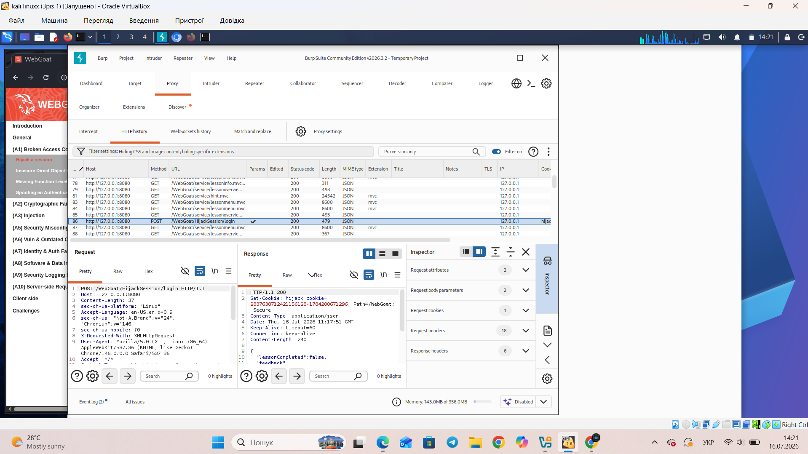
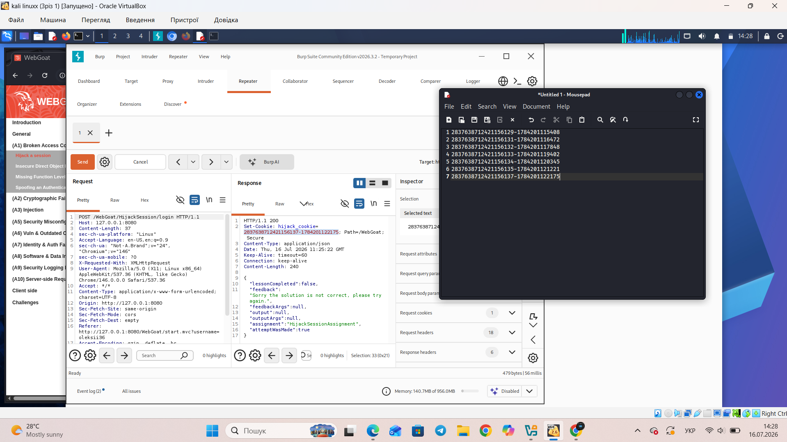
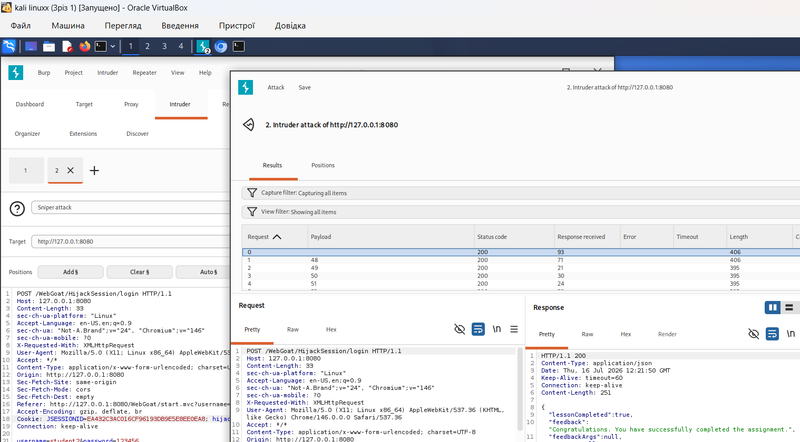
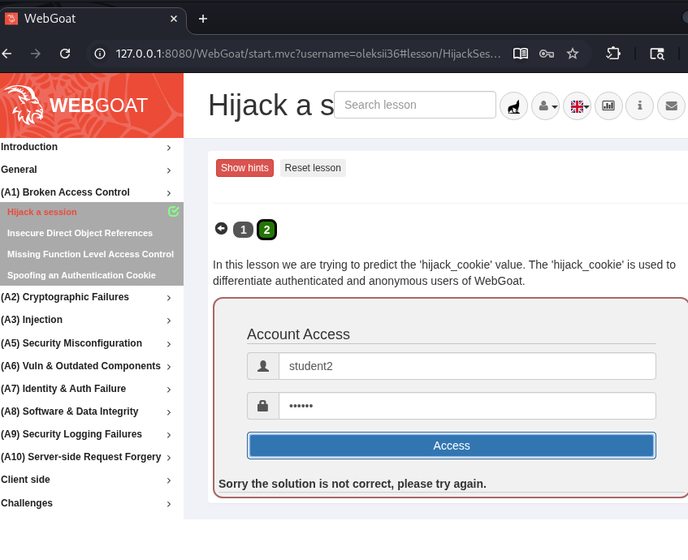

### У цьому уроці ми намагаємося передбачити значення «hijack_cookie». Файл «hijack_cookie» використовується для розрізнення автентифікованих та анонімних користувачів WebGoat.

Спробуємо дослідити за допомогою Burpsuit. Запускаємо його, переходимо на вкладинку "Proxy", запускаємо браузер, в якому відкриваємо "WebGoat" та створюємо користавача і логінуємся або одразу логінуємось (якщо не видаляли контейнер) та переходимо на другий крок, натискаємо "Access", отримуємо помилку та повертаємось до **burpsuit**, де маємо передивитись вкладинку **HTTPhistory**, далі шукаємо відповідь **POST**, в якої міститься інформація про цю помилку (ключ - це зміст **hijack_cookie**, яку нам і потрібно "передбачити"):

Далі натискаємо праву кнопку миші та відправляємо запит до **Repeater**
В **Repeater** робимо декілька повторів (в цьому прикладі може вистачити 5+ запитів)
та бачимо, як змінюється значення **hijack_cookie**, копіюємо ці значення в текстовий редактор:

Бачимо, що між ...29 та ...31 може бути сесія ...30.
Передаємо запит з сесією ...29 до **intruder**:
Далі в **Intruder** формуємо свій запит, запускаємо **start attack** та чекаємо результатів перебору, однак майже одразу отримуємо позитивний результат:

Та відповідно в завданні вкладинка змінює колір з червоного на зелений:

Вітання, завдання пройдено!

