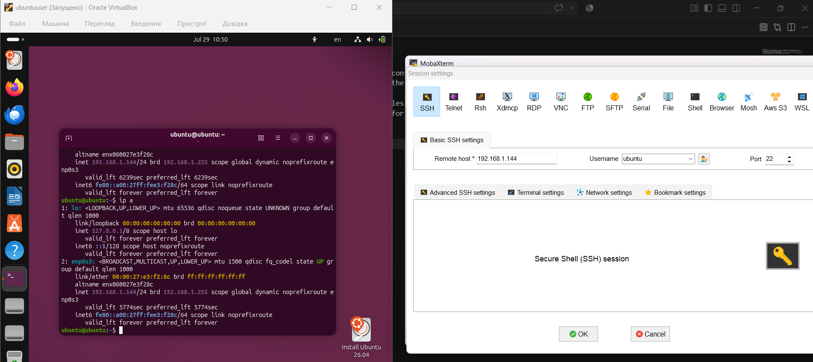

**Кроки:**
1. According to the lecture materials, install, configure, and start the Suricata IDS. 
2. Stop Suricata, add two custom rules based on the example in the presentation materials. It is 
recommended to modify the alert message text. 
3. Start Suricata, ensure that the additional rules are loaded, and test their functionality. 
4. Provide screenshots with a brief explanation for each step.

1.

