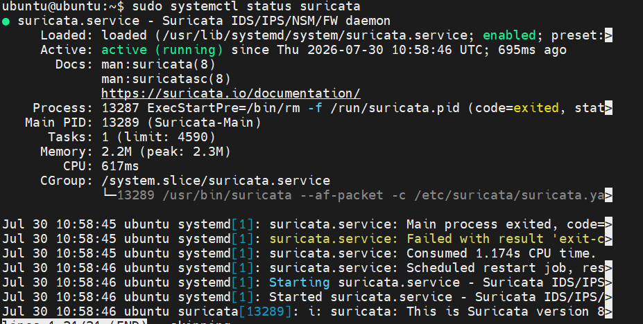
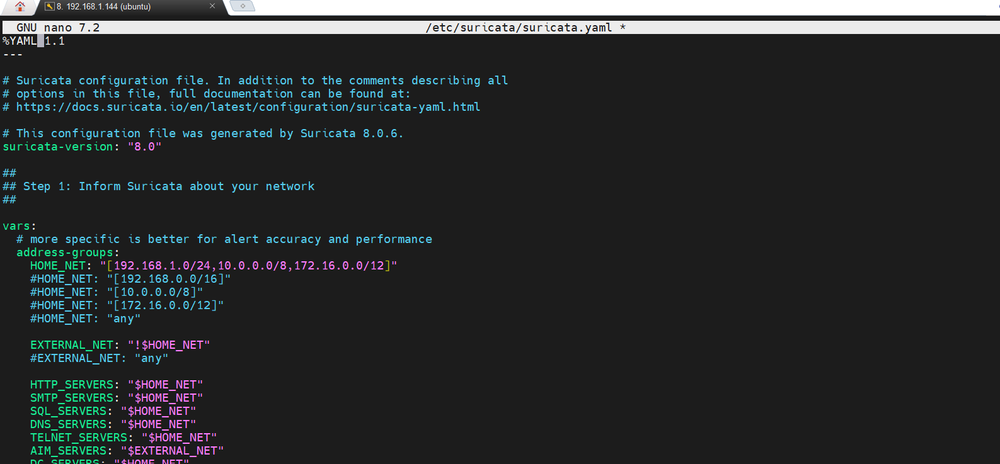
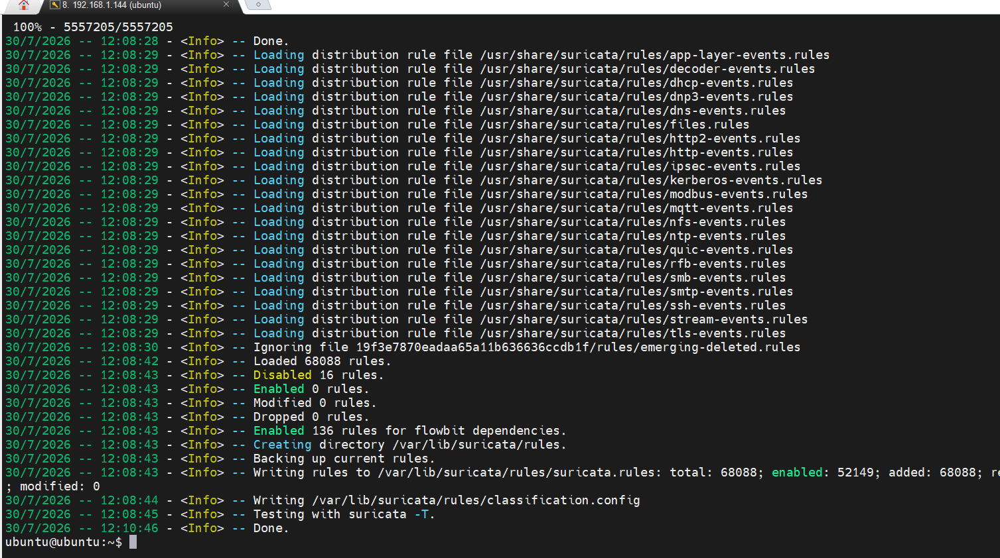
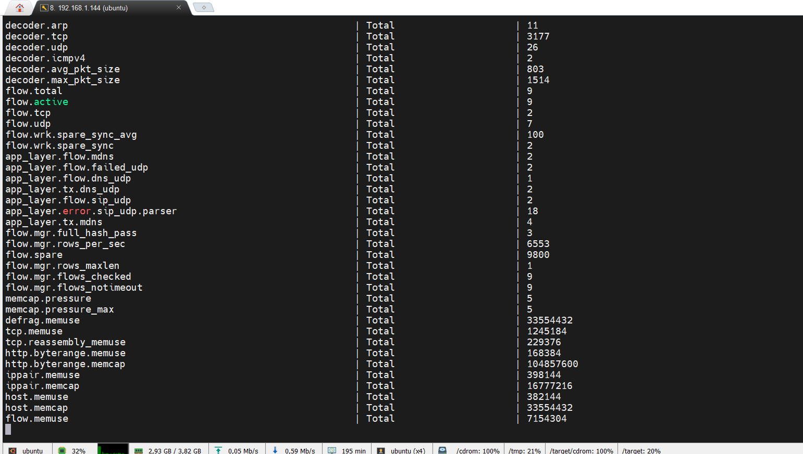
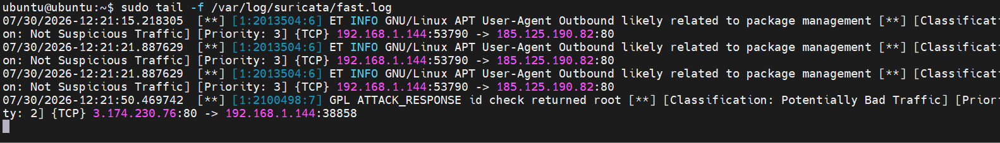
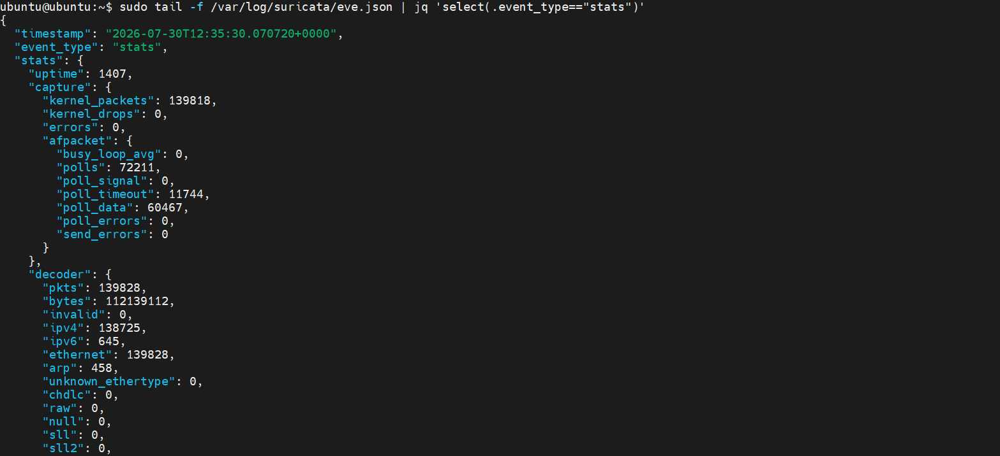
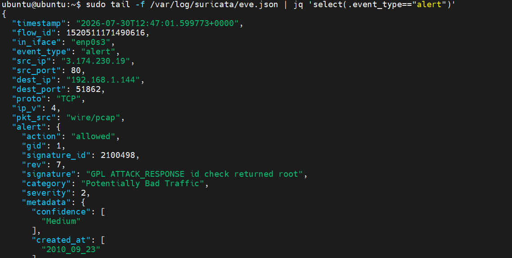
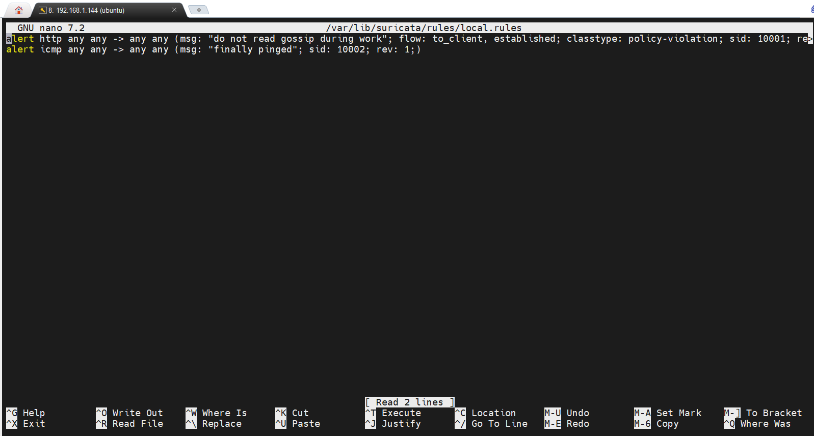
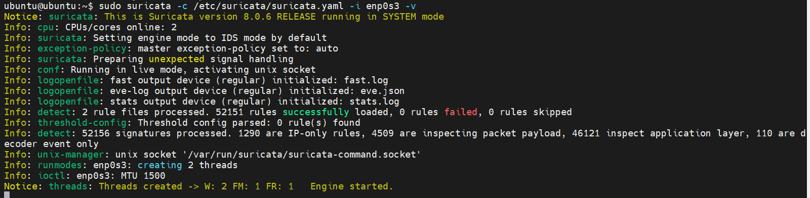
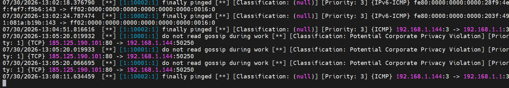

**Кроки:**
1. According to the lecture materials, install, configure, and start the Suricata IDS. 
2. Stop Suricata, add two custom rules based on the example in the presentation materials. It is 
recommended to modify the alert message text. 
3. Start Suricata, ensure that the additional rules are loaded, and test their functionality. 
4. Provide screenshots with a brief explanation for each step.

Запуск ssh сесії

Активація та перевірка статусу сурікати

Зміна конфігурації suricata.yaml

Оновлення правил безпеки sudo suricata-update

запуск та перегляд статистики

sudo tail /var/log/suricata/suricata.log

sudo tail -f /var/log/suricata/stats.log

Тестування роботи командами

sudo tail -f /var/log/suricata/fast.log 

curl http://testmynids.org/uid/index.html

Вивід "eve.json" з фільтром event_type=stats

Вивід "eve.json" з фільтром event_type=alert

Створення своїх правил local.rules

Тестуваня своїх правил
